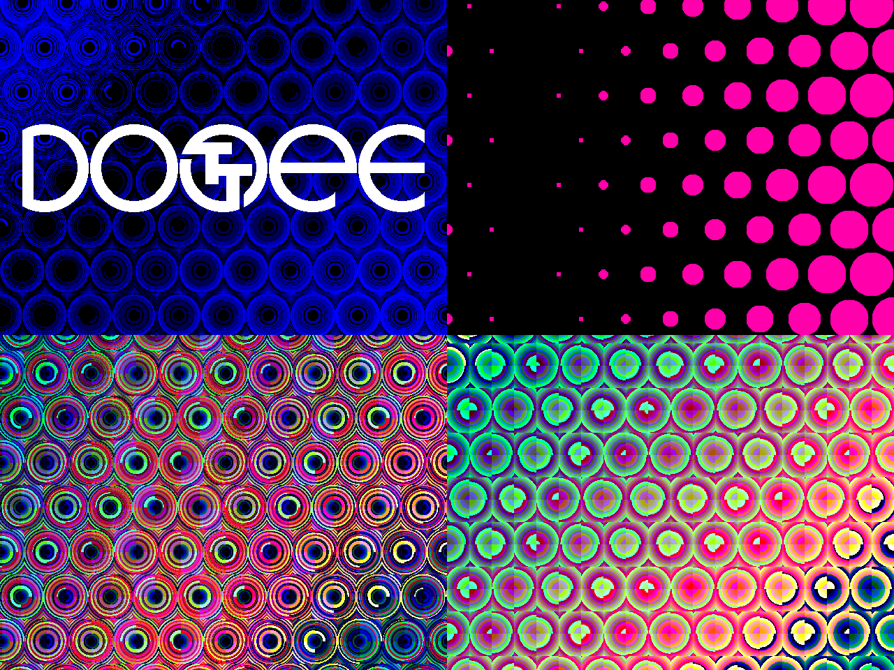

## How it works

DOTTEE is a Verilog/ASIC demoscene project, [originally](https://github.com/algofoogle/ttsky26a-demoscene-dottee/commit/4bf41a170cc7a892566b205456cebf2d75d91f09) submitted to the [Tiny Tapeout ttsky26a Demoscene Competition](https://tinytapeout.com/competitions/demoscene-ttsky26a-announce/) in the 1-tile category. **This is an enhanced version**, resubmitted to the TTGF26a shuttle for fun.

This demo races the beam to create a VGA 640x480 60fps output, while generating some music using a 1-bit sigma-delta DAC. It loops after 4096 frames (about 68 seconds). The main theme of the demo is: **dots** (well, circles). It uses a rough approximation of squared Euclidean distance for per-pixel rendering of an array of multi-coloured circles of various radii. It also uses a Bresenham-like circle calculation to slowly compute the edges of two larger circles (during HBLANK) which are used to construct the "DOTTEE" logo (where the 'TT' in that is a rendition of the Tiny Tapeout logo).

This demo also synthesises some music using a couple of voices (i.e. phase accumulators) that generate triangle waves (but also mangle them a bit to create other effects). New to this TTGF26a version too is a simple noise generator hack (based on vertical line index and some other bit-mangling) that adds simple percussive sounds. Audio output is by converting 6-bit audio samples (at the HSYNC frequency of about 31.5kHz) to 1-bit PDM (at `clk` frequency; i.e. about 25MHz) using a sigma-delta DAC.

## How to test

Keep `ui_in` bits all set to `0`. Attach a Tiny VGA PMOD adapter to the output (`uo_out`) port and a Tiny Audio PMOD adapter to the bidirectional (`uio`) port, supply a ~25MHz clock, and reset the design. Watch and listen!

`ui_in` also gets ORed with the upper 8 bits of the 12-bit frame counter (from which all stages and timing of the demo are derived), so it can be used for debugging by jumping ahead in multiples of 16 frames.

## External hardware

*   [Tiny VGA PMOD](https://github.com/mole99/tiny-vga) for driving a VGA monitor.
*   [TT Audio PMOD](https://github.com/MichaelBell/tt-audio-pmod) for mono sound.

## Attribution

By all means feel free to build upon this project with your own work, but please acknowledge this project and credit me (Anton Maurovic, <https://github.com/algofoogle>, <https://foogle.com/anton>) as the original author.
